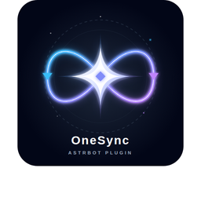

# astrbot_plugin_onesync

> Language / 语言: [English](./README_en.md) | [中文](./README.md)

<div align="center">
  
</div>

<p align="center">
  
  =4.16">
  
  
</p>

OneSync pulls software updates and Skills operations into one AstrBot control plane.

It is built for a practical situation: you maintain more than one software target, you do not want that maintenance to live in scattered shell scripts, and you do not want to fork AstrBot Dashboard just to get a usable operations console. OneSync gives you a full path instead: check, update, verify, audit, plus a dedicated WebUI.

## Quick Navigation

| What do you need right now? | Entry |
| --- | --- |
| Decide whether the project fits your setup | [Core Highlights](#core-highlights) / [Good Fit](#good-fit) |
| Get the plugin running | [Quick Start](#quick-start) |
| Let AI generate the config for you | [Prompt Templates](#prompt-templates) |
| See the main commands | [Common Commands](#common-commands) |
| Understand the WebUI quickly | [WebUI Highlights](#webui-highlights) |
| Understand the Skills model | [Skills Management Highlights](#skills-management-highlights) |
| Triage common failures | [FAQ](#faq) |

| User install | Prompt suite | Ops and release | Developer docs | API docs | Status and roadmap |
| --- | --- | --- | --- | --- | --- |
| [Installation & Config (EN)](./docs/INSTALL_AND_CONFIG_en.md)<br>[安装与配置（中文）](./docs/INSTALL_AND_CONFIG_zh.md) | [Prompt suite in install guide](./docs/INSTALL_AND_CONFIG_en.md#53-ai-one-click-prompt-suite-recommended)<br>[Prompt 套件（中文）](./docs/INSTALL_AND_CONFIG_zh.md#53-ai-一键配置-prompt-套件推荐) | [Ops & Release (EN)](./docs/OPERATIONS_AND_SYNC_en.md)<br>[运维与发布（中文）](./docs/OPERATIONS_AND_SYNC_zh.md) | [Developer Guide (EN)](./docs/DEVELOPER_GUIDE_en.md)<br>[开发指南（中文）](./docs/DEVELOPER_GUIDE_zh.md) | [API Reference (EN)](./docs/API_REFERENCE_en.md)<br>[接口参考（中文）](./docs/API_REFERENCE_zh.md) | [Skills Status (EN)](./docs/SKILLS_UPDATE_STATUS_en.md)<br>[Skills 状态（中文）](./docs/SKILLS_UPDATE_STATUS_zh.md) |

## Core Highlights

### 1. Software updates as a full workflow

- Scheduled checks, manual checks, manual updates, and forced updates.
- Multi-target maintenance instead of a single-tool updater.
- Three primary strategies: `cargo_path_git`, `command`, and `system_package`.
- Post-update verification, persisted state, event logs, and audit replay.

### 2. Embedded WebUI without dashboard patching

- Embedded WebUI at `127.0.0.1:8099`.
- The settings center now uses summary cards plus grouped forms, so config, runtime overview, latest job, and debug logs read as one layered control plane.
- High-frequency actions stay in drawers and Utility panels instead of leaving low-frequency settings expanded in the primary workspace.
- Chinese/English UI switching.
- Filtering by keyword, status, and strategy.

### 3. Skills management organized by maintenance boundary

- Install units and collection groups are the primary management objects.
- Source bundles, deploy targets, and host software live in the same control plane.
- `global / workspace` is a first-class binding scope, and AstrBot local skills now run scope-aware actions.
- `Improve All Skills` refreshes improve-able install atoms first, then executes all actionable aggregate plans with progress and replay.
- `manual_only`, git-backed, repo-metadata, and registry-backed paths stay explicit.
- `Structure & Members` is collapsed by default so primary actions stay visible.

### 4. Built for operations, not just for “it runs”

- Mirrors, multi-remote candidates, and probing support.
- Runtime health, doctor results, and structured diagnostics.
- Batch update flows, aggregate progress, and execution replay.
- Clear separation between source sync and real update execution.

## Good Fit

- You maintain multiple CLI / GUI / Skills-capable hosts on one AstrBot machine.
- You want software updates and Skills maintenance in one ops console.
- You need a plugin that is usable by operators, extensible by developers, and auditable by maintainers.
- You do not want README to carry install help, release process, architecture notes, and API inventory all at once.

## Quick Start

### 1. Install the plugin

```bash
cd <ASTRBOT_ROOT>/data/plugins
git clone https://github.com/Jacobinwwey/astrbot_plugin_onesync.git
```

### 2. Restart AstrBot

```bash
systemctl restart astrbot.service
```

### 3. Run the minimal verification

Send as admin:

```text
/updater status
```

If you get a status summary back, the plugin is loaded correctly.

### 4. Open the embedded WebUI

Enable:

- `web_admin.enabled = true`
- `web_admin.host = 127.0.0.1`
- `web_admin.port = 8099`

Then open:

```text
http://127.0.0.1:8099
```

### 5. Recommended sequence

1. Choose `human` or `developer` mode in Config Center.
2. Define or import software targets.
3. Run `/updater env` or `Run Update (Filtered)` once.
4. Validate one target before moving to batch operations.

For full install, config, and troubleshooting detail:

- [Installation & Config Guide (English)](./docs/INSTALL_AND_CONFIG_en.md)
- [安装与配置指南（中文）](./docs/INSTALL_AND_CONFIG_zh.md)

## Prompt Templates

If you do not want to write config prompts from scratch, use the templates below with Codex, Claude, or ChatGPT.

If the parameter set is large, use the local prompt generator first:

```bash
python3 scripts/onesync_prompt_builder.py \
  --interactive \
  --lang en \
  --scenario suite \
  --output /tmp/onesync_prompt_en.txt
```

### Prompt A: bootstrap and apply in one shot

Use this when you want AI to generate the initial config payload and the apply script in one pass.

```text
You are my OneSync configuration execution assistant.
Please bootstrap and apply OneSync configuration end-to-end.

Goal:
1) Generate valid JSON payload for POST /api/config. The outer shape must be {"config": {...}}.
2) Generate a bash one-click script that:
   - writes onesync_config.json
   - logs in via /api/login if WEBUI_PASSWORD is not empty
   - POSTs /api/config
   - verifies with GET /api/config and GET /api/overview
3) Output exactly 3 sections:
   - JSON_PAYLOAD
   - BASH_ONE_CLICK
   - ASSUMPTIONS
4) No extra commentary. JSON must have no comments or trailing commas.

Input:
WEBUI_URL=http://127.0.0.1:8099
WEBUI_PASSWORD=
TARGET_CONFIG_MODE=human
POLL_INTERVAL_MINUTES=10
DEFAULT_CHECK_INTERVAL_HOURS=12
AUTO_UPDATE_ON_SCHEDULE=true
TARGETS_YAML:
- name: zeroclaw
  strategy: cargo_path_git
  enabled: true
  check_interval_hours: 12
  repo_path: /home/jacob/zeroclaw
  binary_path: /root/.cargo/bin/zeroclaw
  upstream_repo: https://github.com/zeroclaw-labs/zeroclaw.git
  build_commands:
    - cargo install --path {repo_path}
  verify_cmd: "{binary_path} --version"
```

### Prompt B: incrementally add one target

Use this when the existing config already works and you only want to merge one more software target without wiping anything else.

```text
You are my OneSync config merge assistant.
Add one new software target while preserving all existing settings and targets.

Execution rules:
1) Read current config from GET {WEBUI_URL}/api/config.
2) Merge my new target incrementally and do not overwrite unrelated targets.
3) Output:
   - UPDATED_JSON_PAYLOAD
   - BASH_APPLY_PATCH
   - CHANGE_SUMMARY
4) If the target name already exists, update it in place instead of duplicating it.

Input:
WEBUI_URL=http://127.0.0.1:8099
WEBUI_PASSWORD=
NEW_TARGET:
  name: mytool
  strategy: command
  enabled: true
  check_interval_hours: 12
  current_version_cmd: /usr/local/bin/mytool --version
  latest_version_cmd: curl -fsSL https://example.com/mytool/latest.txt
  latest_version_pattern: (\\d+\\.\\d+\\.\\d+)
  update_commands:
    - bash /opt/scripts/update-mytool.sh
  verify_cmd: /usr/local/bin/mytool --version
```

### Prompt C: diagnose and repair config failures

Use this for `404`, config-apply failures, or path mismatch problems.

```text
You are my OneSync troubleshooting assistant.
Output a runnable plan in order: diagnose -> fix -> verify.

Required diagnostics:
1) GET {WEBUI_URL}/api/health
2) GET {WEBUI_URL}/openapi.json and confirm `/api/config` exists
3) GET {WEBUI_URL}/api/config
4) If /api/config is 404, provide the minimum fix sequence:
   - restart service
   - confirm web_admin_url
   - browser hard refresh with Ctrl+F5

Output:
- DIAGNOSIS
- FIX_COMMANDS
- VERIFY_COMMANDS
- ROLLBACK_PLAN

Environment:
WEBUI_URL=http://127.0.0.1:8099
SERVICE_NAME=astrbot.service
```

Full prompt suite and generator usage live here:

- [Installation & Config Guide (English)](./docs/INSTALL_AND_CONFIG_en.md#53-ai-one-click-prompt-suite-recommended)
- [安装与配置指南（中文）](./docs/INSTALL_AND_CONFIG_zh.md#53-ai-一键配置-prompt-套件推荐)

## Common Commands

| Command | Purpose |
| --- | --- |
| `/updater status` | show plugin and target status |
| `/updater check [target]` | check versions without updating |
| `/updater run [target]` | check and update if needed |
| `/updater force [target]` | force update execution |
| `/updater env [target]` | verify runtime commands, paths, and versions |

Notes:

- `target` is optional. If omitted, all configured targets are used.
- Running `/updater env` before a wider rollout is still the safest first step.

## WebUI Highlights

The WebUI is built around three practical needs: write the config correctly, watch the execution clearly, and diagnose failures without guessing.

- `Config Center`
  - summary cards surface current mode, polling, port, and password state first
  - direct config read/write with `human` / `developer` dual-mode support
- `AI Assistant`
  - bootstrap, incremental add, diagnose/repair, and full-suite prompt generation
- `Improve All Skills`
  - refreshes improve-able install atoms first, then runs actionable aggregate updates
  - shares one backend progress contract with the progress bar, latest report, and replay history
- `AstrBot Local Skills`
  - toggle, delete, and sandbox-sync local AstrBot skills under explicit `global / workspace` scope
- `Latest Job`
  - recent software-update execution summary
- `Debug Logs`
  - tabs, level filter, keyword filter, clear action
- `Guide`
  - user flow and developer flow help

If your immediate goal is “get software update working safely”, the practical order is:

1. `Config Center`
2. `AI Assistant`
3. `Run Update (Filtered)`
4. `Latest Job`
5. `Debug Logs`

## Skills Management Highlights

OneSync does not mirror a raw `npx skills ls` dump. It organizes the Skills surface around maintenance boundaries.

- Installed, skill-capable hosts are shown first.
- Uninstalled candidates can still be revealed deliberately.
- `global / workspace` is a first-class binding scope, and AstrBot local actions always carry that scope explicitly.
- `Improve All Skills` collapses install-atom refresh plus batch aggregate update into one primary action while keeping a replayable report.
- The right-side inspector focuses on the current source / install unit / deploy target.
- Longer sections such as `Structure & Members` and `Execution Preview & Audit` stay collapsible.

The update boundary is explicit:

- npm / registry-backed aggregates: updateable
- git-backed `skill_lock` aggregates: updateable after managed checkout bootstrap
- repo-metadata sources: source-sync fallback
- `local_custom` / `synthetic_single` / `derived`: explicitly `manual_only`

The point is not to make everything look updateable. The point is to make it obvious:

- what can be maintained automatically
- what can only refresh metadata
- what still needs manual handling

## FAQ

### 1. The page shows `Failed to load config: 404 Not Found`

Try this order first:

1. `systemctl restart astrbot.service`
2. make sure you opened OneSync’s own `web_admin_url`
3. hard refresh the browser with `Ctrl+F5`
4. verify:
   - `curl -i http://127.0.0.1:8099/api/config`
   - `curl -s http://127.0.0.1:8099/openapi.json | jq -r '.paths | keys[]'`

### 2. An update succeeded, but the Skills panel still looks stale

The current mainline already fixes two common false positives:

- binding saves no longer depend on an inventory rescan to converge
- successful install-unit / collection command updates now stamp freshness anchors immediately, so false `AGING` state should clear on the next rebuild

If the panel still looks wrong, check:

- whether the source is actually `manual_only`
- whether the path used real command update or `source sync fallback`
- if this is an AstrBot local skill, whether the selected scope is correct; `workspace` actions do not write back into `global`
- whether `Debug Logs` or `doctor` show a structured error

### 3. Should I use `human` or `developer` mode?

- normal users: start with `human`
- advanced operators needing mirrors, regex, timeout tuning, or larger target sets: use `developer`

## Documentation Boundaries

The docs are now split by role. README is intentionally not the whole documentation set.

| If you need to... | Start here |
| --- | --- |
| install, configure, or troubleshoot | [Installation & Config Guide (English)](./docs/INSTALL_AND_CONFIG_en.md) |
| publish, sync, or prepare bilingual releases | [Operations and Sync Manual (English)](./docs/OPERATIONS_AND_SYNC_en.md) |
| understand code structure and extension points | [Developer Guide (English)](./docs/DEVELOPER_GUIDE_en.md) |
| script against the WebUI or integrate frontend/API flows | [API Reference (English)](./docs/API_REFERENCE_en.md) |
| understand current Skills update support limits | [Skills Update Status (English)](./docs/SKILLS_UPDATE_STATUS_en.md) |

If this project helps with real AstrBot maintenance work, a Star is appreciated.
